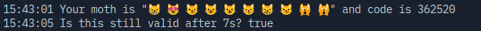

# moths 🪰

> e**mo**jicon au**th**entication**s**

## what (is this 💩)

Emojies as [TOTP](https://rublon.com/blog/hotp-totp-difference/), [because](#why).

## why

Because we _all_ **could** use a little more emotion in our lives 🤗 Go show the world how you really feel!

It's a great companion for any app that uses 2FA - as every app should! Make your app's 2FA users as star-striking as your app! 🤩

So whether your mascot is:

0. 🦋
1. 🐰
2. 🐶
3. 🐕
4. 🐷
5. 🐥
6. 🐱
7. 🐣
8. 🐻
9. 🐈

**moths** has got you covered! 🪰

> P.S. These emojies wasn't chosen by accident (random), they really are the 10 ut[most frequently used (animal) emojies of 2021](https://home.unicode.org/emoji/emoji-frequency/)

Show that sparkly emojies ✨

## how

Running this is quite easy 💨

0. Download the dependencies ⏬

> **Note**
>
> You can skip this step and let the `run`-command handle it - but you knew that 🧠

```sh
go mod download
```

1. Make a secret of **32** characters 🔐

```sh
echo -n "MOTHS_SECRET=" > .env
echo 'moths' | sha256sum | base64 | head -c 32 >> .env
```

2. Run the program 🏃

```sh
go run .
```

As I said, easy-peasy! 💖

### Options

To setup a new `moth`-generator, you must call `moths.NewMoths` as

```go
gen, err := moths.NewMoths()
```

But I do recommend to add some customization, as it will fail immediately if not.

Like so

```go
gen, err := moths.NewMoths(
  moths.WithSecret(secret),
  moths.WithInterval(generationInterval),
  moths.WithAmount(amount),
  moths.WithEmojies(emojies.CATS),
  moths.WithTime(time.Now().AddDate(10, 0, 0)), // 10 years into the future
)
```

There are a few options to choose from, these are

- `WithSecret(secret string)`**\***
  - The secret to generate from
  - Must be 32 characters ⚠
- `WithInterval(interval time.Duration)`**\***
  - On which interval should a new `moth` be generated
  - A `moth` will only be valid during this time-frame
- `WithAmount(amount int)`**\***
  - The amount of emojies to generate
- `WithEmojies(emojies emojies.Emojies)`**\***
  - Take a look in the [`emojies`](moths/emojies)-package to see your options
  - You can also add new emojies
- `WithTime(t time.Time)`
  - This will allow you to add a custom time
  - Meaning you can validate towards old `moths`
  - ...
  - You can even add a future date ⌛

Options marked with an asterix (\*) are required

## sample 🤔




## History ✍

- [`v1.0.0`](https://github.com/Mobilpadde/moths/tree/v1.0.0)
- [`v0.1.0`](https://github.com/Mobilpadde/moths/tree/v0.1)

## shoutout 📢💨

I couldn't have done it without these lovely OSS 🦾

- <https://github.com/aidarkhanov/nanoid>
- <https://github.com/enescakir/emoji>
- <https://github.com/tilaklodha/google-authenticator>
- <https://github.com/pquerna/otp/>

In no specific order 🤷
