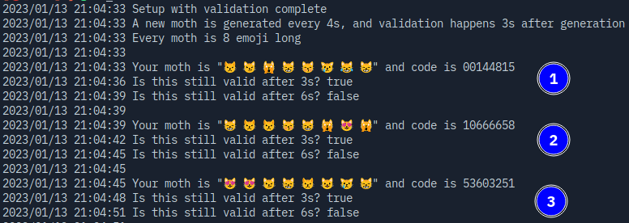

# moths

> e**mo**jicon au**th**entication**s**

## what

Emojies as OTP (2FA)

## why

Because why not?

## how

Runnig this is quite easy.

- Download the dependencies

  ```sh
  go mod download
  ```

- Make a secret

  ```sh
  echo -n "MOTHS_SECRET=" > .env; echo 'moths' | sha256sum | base64 | head -c 32 >> .env
  ```

- Start the program

  ```sh
  go run .
  ```

As I said, easy-peasy!

## sample



<details>
  <summary>v0.1</summary>

A sample out-put might be `😻🙀😺🙀🙀` which would equal the `920811` TOTP-token. Using the super secret secret of `😻` - genereated at `2022/04/28 02:05:42 AM` and a `5`-second interval.

Can be checked out at [`v0.1`](https://github.com/Mobilpadde/moths/tree/v0.1)

</details>

## shoutout

I couldn't have done it without the lovely OSS's listed below:

- https://github.com/aidarkhanov/nanoid
- https://github.com/enescakir/emoji
- https://github.com/tilaklodha/google-authenticator
